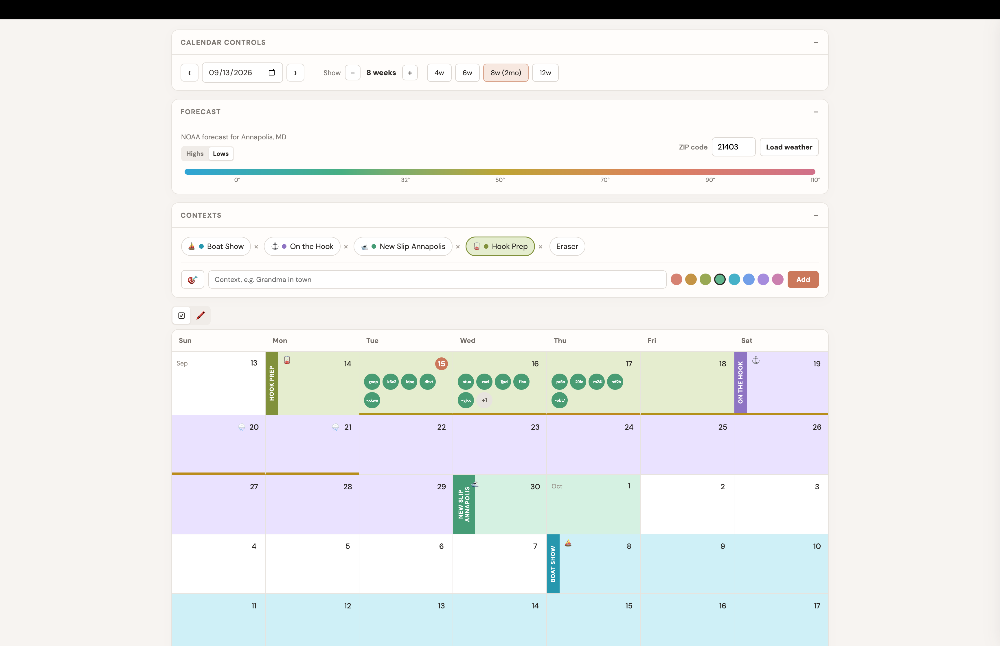

## Calendurr
_(pronounced Calen-durr)_

**Calendar interfaces suck. All of them.** 
- Life doesn't work in monthly blocks, but that's all calendars can do - so you end up opening up each month and tab-toggling. Gross.
  Calendurr uses weeks ahead of/before Today, the way we actually do stuff.
- Things tend to happen over ranges and then inside those ranges: 
    - "Grandma is visiting" goes from Monday until Friday
    - "take Grandma to get cheesesteaks" happens on Tuesday while she is visiting     
  These shouldn't be events that conflict - one thing is an event, the other is context. 
  Some apps can _sorta_ show this, but not well.
- Todo things tend to pile up at once, so Calendurr makes it easy to show a LOT of items on a single day. 

<figure>
  
  <figcaption>One view spanning many months, showing temp and weather as color bars, displaying contexts outside events.</figcaption>
</figure>

So this interface solves the things I hate about calendar planning. 

## Is This A TODO App? A Calendar App? 
nope, Calendurr is a skin. I have no interest in building any of those things, there are a gazillion out there. This is just a better way to interface with the data those things create/operate with. Pick your favorite todo/task/calendar thing and point an agent at it, add an adapter, and you are set to go. 

## Example: Running With TaskWarrior

Calendurr is a just a non-crappy web UI, all client side with no backend. You can stick it on whatever you use for tasks, with a little adapting. To test this claim, I've set up a by the local TaskWarrior adapter, so you can use that if you want. Start it on the machine that has TaskWarrior configured:

```sh
python3 server.py
```

Then open `http://127.0.0.1:8787`. The Python server serves the UI and translates its generic task model to TaskWarrior commands. TaskWarrior remains responsible for syncing with Taskserver, including its server, credentials, and certificates.

The server binds to localhost deliberately. For remote access, put it behind an authenticated HTTPS reverse proxy rather than exposing the TaskWarrior API directly.

The integration defines two TaskWarrior UDAs, `calendurr_description` and `calendurr_priority_order`, to preserve Calendurr's task description and within-day ordering.

### Task Model

Tasks use a deliberately small, tool-agnostic shape and must have a date:

```js
{
  id: 'T123456',
  title: 'Take Grandma to get cheesesteaks',
  description: 'Meet at 12:30.',
  date: '2026-09-08',
  labels: ['family', 'errand'],
  project: 'Grandma visit',
  priorityOrder: 0,
  status: 'todo'
}
```

`id` is an opaque identifier. `priorityOrder` sorts tasks that share a date. A task with `status: 'done'` is complete; all other values are treated as open. Tasks without a `date` are not stored or displayed.

## What's Up With The Weather
Lots of things in life depend on the weather, yet another thing that is difficult to get visually on most calendar apps. In this case it is baked in.
